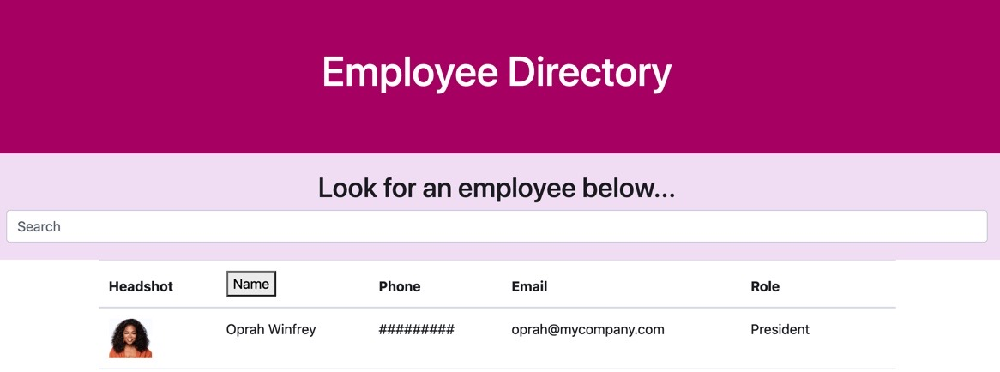

# Employee Database

### Table of Contents

1. [Links](#links)
2. [Description](#description)
3. [App](#app)
4. [Usage](#usage)

## Links

- [Deployed Link](https://dry-mountain-53041.herokuapp.com/)
- [GitHub Link](https://github.com/mkgude/employee-roster)

## Description

- This is a database where you can come to look for an entire list of your employees. You will be able to filter by name and search for employee by name.

## App

## Usage

- In the search bar, type in an employees name and you will see an employee show up. If you want to alphabatize your database by name, select the name button and you will be able to sort your employees by first name.
